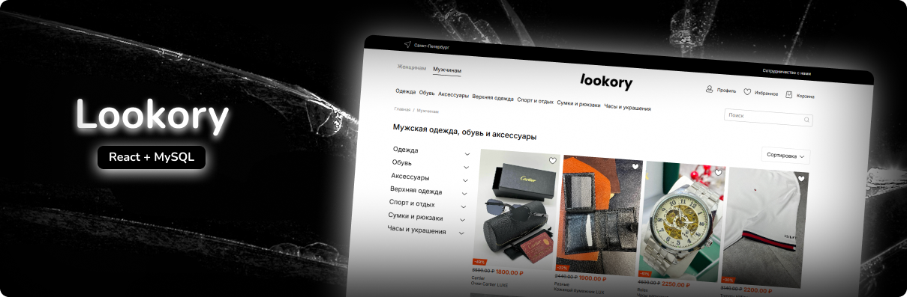
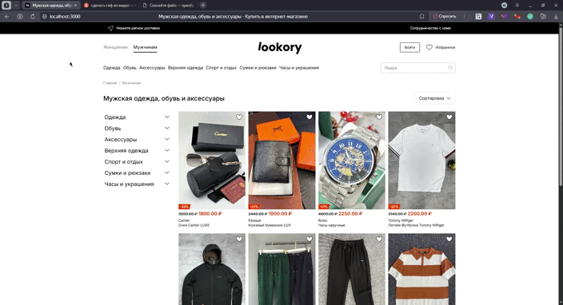
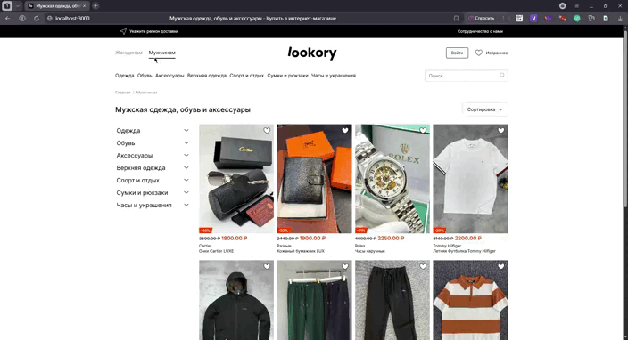
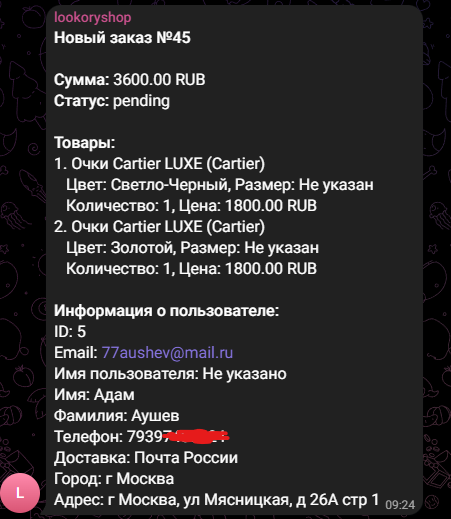

<div align="center">
  <br />
    <a href="https://github.com/magasov" target="_blank">
      
    </a>
  <br />
 
  <p>
    <code></code>
    <code></code>
    <code></code>
    <code></code>
    <code></code>
  </p>
  <h1 align="center">lookory</h1>

   <div align="center">
     Интернет-магазин для дропшиппинга: авторский дизайн, продуманная логика и полная техническая реализация.
    </div>
</div>

## 🖼️ Галерея проекта

<div align="center">
  <h3>Главная страница</h3>
  
  
  <h3>Страница товара</h3>
  
  
  <h3>Корзина</h3>
  
  
  <h3>Админ-панель</h3>
  
  
  <h3>Мобильная версия</h3>
  

  <h3>После оплаты на странице Юкассы приходит уведомление с состоянием (pending и т.д) в тг</h3>
  
</div>

## 🚀 Что реализовано

- ⭐ Избранное с сохранением и быстрым доступом
- ➕🗑️ Добавление и удаление товаров
- 📊 Сортировка товаров по категориям и подкатегориям
- 🔍 Поиск по товарам на сайте
- 🛒 Добавление/удаление товаров в корзину и избранное
- 👨‍💻 Админ-панель:
  - Расширенное добавление товаров
  - Создание категорий и подкатегорий
- 📱 Полностью адаптивный дизайн под любые устройства
- 💳 Оформление заказов через ЮKassa
- 🏙️ Поиск городов и складов СДЭК
- 📦 Интеграция с Почтой России
- 📦 Мои заказы с статусами:
  - Ожидание оплаты
  - Оплачено
  - Получено
- 📢 Уведомления продавцу в Telegram о новых заказах
- 🔒 Авторизация по почте с подтверждением через ссылку
- 🎞 Адаптивные слайдеры изображений
- 🏷️ SEO-оптимизация с мета-тегами
- 🎭 Роли (Admin, User)

## 📋 Tech Stack

### 🧩 Frontend (React 19)

- ⚛️ React 19 + React DOM
- 🔄 Redux Toolkit + React-Redux
- 🛣️ React Router DOM v7
- 📡 Axios для HTTP-запросов
- 💅 Sass для стилизации
- 🎨 React Icons v5
- 🏗️ React Content Loader (скелетоны)
- 🚀 React Helmet Async (SEO)
- 🎠 Slick Carousel + React Slick
- 🔊 Sonner (уведомления)
- 🏗️ Motion (анимации)
- 🧪 Тестирование:
  - Testing Library (DOM/Jest/User Event)

### ⚙️ Backend (Node.js + Express)

- 🚂 Express.js
- 🛡️ Helmet (безопасность)
- 📊 Sequelize (ORM) + MySQL2
- 🔐 JWT + bcrypt (аутентификация)
- 📨 Nodemailer (почта)
- 📦 Multer (загрузка файлов)
- ⏱️ Express Rate Limit
- 🌐 CORS + dotenv
- 💰 Платежи:
  - Yandex Checkout
  - YooMoney SDK
- 🆔 UUID
- 📡 Node Fetch (HTTP-клиент)
- 📊 Morgan (логирование)
- 🔄 Nodemon (разработка)


## 🚀 Как начать

1. Установите [Node.js](https://nodejs.org/) (рекомендуется версия 18+).

2. Склонируйте репозиторий:
   ```bash
   git clone https://github.com/magasov/lookory.git
   cd lookory
   ```
3. В корне backend-проекта создайте файл .env и добавьте в него следующие переменные окружения (без кавычек и с вашими значениями):
   ```env
    JWT_SECRET=your_jwt_secret_key
    EMAIL_USER=your_email@gmail.com
    EMAIL_PASS=your_app_password
    DB_HOST=localhost
    DB_USER=your_db_username
    DB_PASSWORD=your_db_password
    DB_NAME=your_database_name
    PORT=8080
    CLIENT_URL=http://localhost:3000
    API_URL=http://localhost:8080
    YOOKASSA_SHOP_ID=your_shop_id
    YOOKASSA_SECRET_KEY=test_your_test_key
    YOOKASSA_TEST_MODE=1
    TELEGRAM_BOT_TOKEN=your_telegram_bot_token
    TELEGRAM_GROUP_ID=your_telegram_chat_id
   ```

> ⚠️ **Генерация пароля для отправки писем**  
> https://myaccount.google.com/apppasswords 

> ⚠️ **Сервис для данных адресов**  
> https://dadata.ru/

4. В корне frontend-проекта создайте файл .env и добавьте в него следующие переменные окружения (без кавычек и с вашими значениями):
   ```env
    REACT_APP_APIURL=http://localhost:8080

    REACT_APP_DADATA_TOKEN=ВАШ-ТОКЕН-ДАДАТА
    REACT_APP_DADATA_SECRET=ВАШ-КЛЮЧ-ДАДАТА

    SDEK_API_URL=https://api.edu.cdek.ru/v2
    SDEK_CLIENT_ID=ВАШ-ИД-СДЭК
    SDEK_CLIENT_SECRET=ВАШ-КЛЮЧ-СДЭК
    SDEK_SENDER_ADDRESS="г. Москва, ул. Ленина, д. 1 | поменяйте на адресс вашего магазина"

    YOOKASSA_SHOP_ID=ВАШ-ИД-ЮКАССА
    YOOKASSA_SECRET_KEY=ВАШ-СЕРКРЕТНЫЙКЛЮЧ-ЮКАССА
    YOOKASSA_TEST_MODE=1

   ```

5. Установите зависимости и запустите backend:

   ```bash
   cd api
   npm install
   npm run dev
   ```

6. Запустите frontend (в другом терминале):

   ```bash
   cd ../client
   npm install
   npm start
   ```

7. Откройте в браузере: http://localhost:3000

